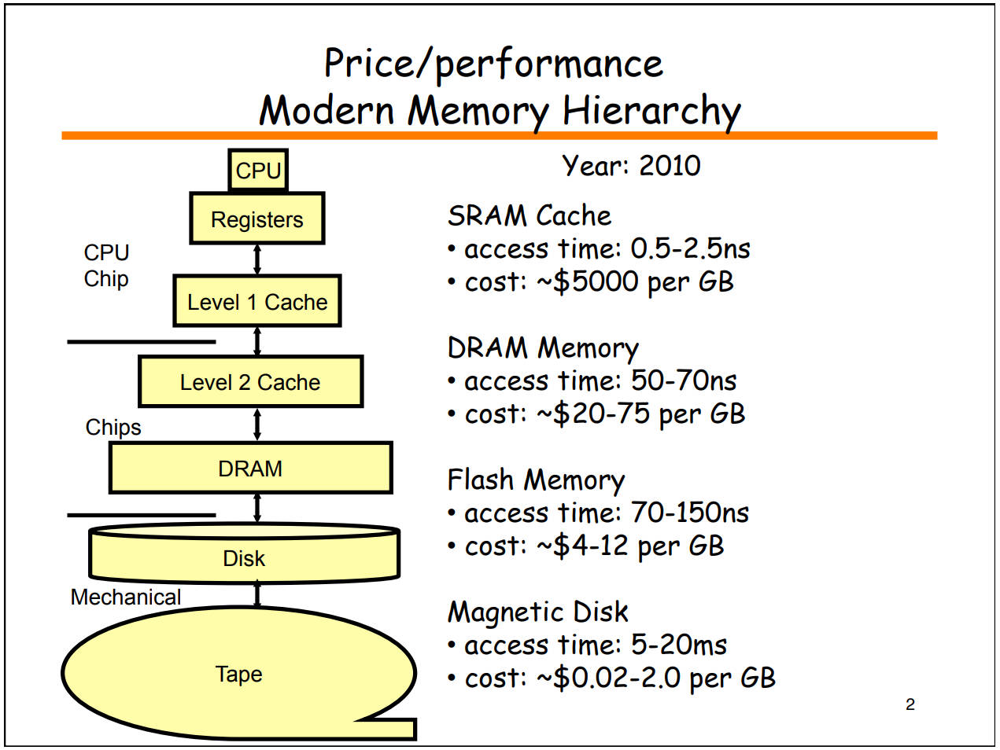

<!-- START doctoc generated TOC please keep comment here to allow auto update -->
<!-- DON'T EDIT THIS SECTION, INSTEAD RE-RUN doctoc TO UPDATE -->
**Table of Contents**  *generated with [DocToc](https://github.com/thlorenz/doctoc)*

- [CPU内部线路放大10次](#cpu%E5%86%85%E9%83%A8%E7%BA%BF%E8%B7%AF%E6%94%BE%E5%A4%A710%E6%AC%A1)
- [不同存储设备在2010年时的造价](#%E4%B8%8D%E5%90%8C%E5%AD%98%E5%82%A8%E8%AE%BE%E5%A4%87%E5%9C%A82010%E5%B9%B4%E6%97%B6%E7%9A%84%E9%80%A0%E4%BB%B7)
- [不同操作的延迟时间](#%E4%B8%8D%E5%90%8C%E6%93%8D%E4%BD%9C%E7%9A%84%E5%BB%B6%E8%BF%9F%E6%97%B6%E9%97%B4)
- [CPU缓存架构](#cpu%E7%BC%93%E5%AD%98%E6%9E%B6%E6%9E%84)
- [其他参考资料](#%E5%85%B6%E4%BB%96%E5%8F%82%E8%80%83%E8%B5%84%E6%96%99)

<!-- END doctoc generated TOC please keep comment here to allow auto update -->

# CPU内部线路放大10次

<video src="../assets/1.CPU_Memory_Disk/CPU内部线路放大10次.mp4" style="display:block;margin:auto;width:100%;"/>
[来源：为什么说 CPU 是人造物的巅峰？](https://www.zhihu.com/question/378861322/answer/1100855720)

***
# 不同存储设备在2010年时的造价

来源：[https://www.cs.utexas.edu/users/mckinley/352/lectures/21.pdf](https://www.cs.utexas.edu/users/mckinley/352/lectures/21.pdf)

***
# 不同操作的延迟时间

由于硬件发展速度很快，以下数据（大约基于2020年代的硬件）仅供参考：

| 耗时（近似值）          | 典型操作                                                     |
| ----------------------- | ------------------------------------------------------------ |
| 0.1-1ns                 | CPU 访问寄存器；一个时钟周期；                               |
| 1-10ns                  | CPU 访问 L1 级缓存；CPU 访问 L2 级缓存；                     |
| 10-100ns                | CPU 访问 L3 级缓存；某些高效 CPU 访问内存（如 Apple M1 ）；  |
| 100-1000ns（0.1-1µs）   | Linux 系统调用；MD5 计算文本的 Hash 值；                     |
| 1-10µs                  | 进程上下文切换；复制 64KB 的内存；                           |
| 10-100µs                | 处理一个 HTTP 请求；从内存中顺序读取 1M 数据；从 SSD 中读取 8K 数据； |
| 100-1000us（0.1-1ms）   | 往 SSD 中写 8K 数据；相同区域内(intra-zone)一次网络的来回；Redis 在内网中的一次 Get 请求（约 1ms）； |
| 1ms-10ms                | 不同区域内(inter-zone)一次网络的来回；HDD 的一次寻道时间；   |
| 10ms-100ms              | 美国西部到东部的一次网络来回；美国东部到欧洲的一次网络来回；从内存中顺序读取 1G 数据； |
| 100ms-1000ms（0.1s-1s） | 一次 TLS 握手；bcrypt 一个密码；从 SSD 中顺序读取 1G 数据；  |
| 1s以上                  | 在相同云区域通过网络传输 1G 数据；                           |

数据来源：[Latency Numbers Programmer Should Know (for the 2020s)](https://www.youtube.com/watch?v=FqR5vESuKe0)

***
# CPU缓存架构

[来源：与程序员相关的CPU缓存知识](https://coolshell.cn/articles/20793.html)

***

# CPU缓存影响代码性能的示例

[视频讲解](https://www.bilibili.com/video/BV1ds4y1P7Hc/)

按行遍历：<a src="codes/1.CPU_Memory_Disk/CPU/cache_iterate_by_row.c" target="_blank">cache_iterate_by_row.c</a>

按列遍历：<a src="codes/1.CPU_Memory_Disk/CPU/cache_iterate_by_row.c" target="_blank">cache_iterate_by_col.c</a>

这两段代码中，按行遍历的效率比按列遍历的效率高，因为按行遍历利用了CPU Cache。

***
# 利用CPU分支预测提升代码性能示例1

[视频讲解](https://www.bilibili.com/video/BV1KX4y167TW/)

利用了CPU分支预测特性：<a src="codes/1.CPU_Memory_Disk/CPU/BranchPrediction1WithSort.java" target="_blank">BranchPrediction1WithSort.java</a>

未利用CPU分支预测特性：<a src="codes/1.CPU_Memory_Disk/CPU/BranchPrediction1WithoutSort.java" target="_blank">BranchPrediction1WithoutSort.java</a>

***
# 利用CPU分支预测提升代码性能示例2

对CPU分支预测友好的代码：<a src="codes/1.CPU_Memory_Disk/CPU/BranchPrediction2SmallToLarge.java" target="_blank">BranchPrediction2SmallToLarge.java</a>

对CPU分支预测不友好的代码：<a src="codes/1.CPU_Memory_Disk/CPU/BranchPrediction2LargeToSmall.java" target="_blank">BranchPrediction2LargeToSmall.java</a>

***
# 其他参考资料

[GitHub仓库：hardware-effects（硬件对程序的影响）](https://github.com/Kobzol/hardware-effects)

[油管视频：How a CPU Works](https://www.youtube.com/watch?v=cNN_tTXABUA)

[维基百科：CPU cache](https://en.wikipedia.org/wiki/CPU_cache)

[维基百科：Memory bandwidth](https://en.wikipedia.org/wiki/Memory_bandwidth)

[GitHub文章：Latency Numbers Every Programmer Should Know](https://colin-scott.github.io/personal_website/research/interactive_latency.html)

