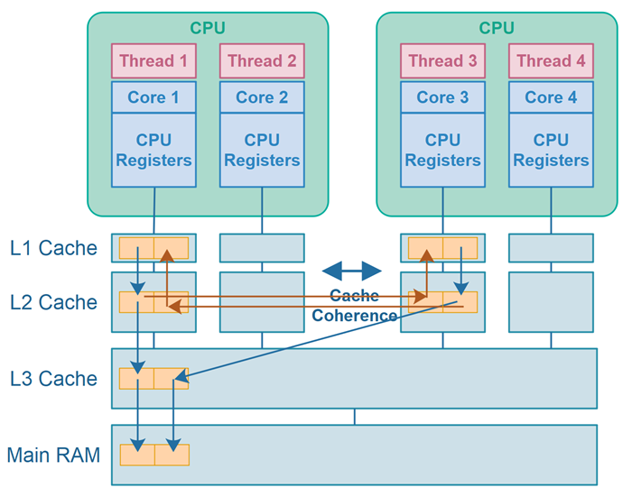

<!-- DON'T EDIT THIS SECTION, INSTEAD RE-RUN doctoc TO UPDATE -->

**Table of Contents**  *generated with [DocToc](https://github.com/thlorenz/doctoc)*

- [CPU内部线路放大10次](#cpu%E5%86%85%E9%83%A8%E7%BA%BF%E8%B7%AF%E6%94%BE%E5%A4%A710%E6%AC%A1)
- [不同存储设备在2010年时的造价](#%E4%B8%8D%E5%90%8C%E5%AD%98%E5%82%A8%E8%AE%BE%E5%A4%87%E5%9C%A82010%E5%B9%B4%E6%97%B6%E7%9A%84%E9%80%A0%E4%BB%B7)
- [不同操作的延迟时间](#%E4%B8%8D%E5%90%8C%E6%93%8D%E4%BD%9C%E7%9A%84%E5%BB%B6%E8%BF%9F%E6%97%B6%E9%97%B4)
- [CPU缓存架构](#cpu%E7%BC%93%E5%AD%98%E6%9E%B6%E6%9E%84)
- [CPU缓存影响代码性能的示例](#cpu%E7%BC%93%E5%AD%98%E5%BD%B1%E5%93%8D%E4%BB%A3%E7%A0%81%E6%80%A7%E8%83%BD%E7%9A%84%E7%A4%BA%E4%BE%8B)
- [CPU分支预测影响代码性能示例1](#cpu%E5%88%86%E6%94%AF%E9%A2%84%E6%B5%8B%E5%BD%B1%E5%93%8D%E4%BB%A3%E7%A0%81%E6%80%A7%E8%83%BD%E7%A4%BA%E4%BE%8B1)
- [CPU分支预测影响代码性能示例2](#cpu%E5%88%86%E6%94%AF%E9%A2%84%E6%B5%8B%E5%BD%B1%E5%93%8D%E4%BB%A3%E7%A0%81%E6%80%A7%E8%83%BD%E7%A4%BA%E4%BE%8B2)
- [CPU分支预测影响代码性能示例3](#cpu%E5%88%86%E6%94%AF%E9%A2%84%E6%B5%8B%E5%BD%B1%E5%93%8D%E4%BB%A3%E7%A0%81%E6%80%A7%E8%83%BD%E7%A4%BA%E4%BE%8B3)
- [缓存冲突](#%E7%BC%93%E5%AD%98%E5%86%B2%E7%AA%81)
- [数据依赖](#%E6%95%B0%E6%8D%AE%E4%BE%9D%E8%B5%96)
- [伪共享](#%E4%BC%AA%E5%85%B1%E4%BA%AB)
- [没搞懂或未重现的一些知识点](#%E6%B2%A1%E6%90%9E%E6%87%82%E6%88%96%E6%9C%AA%E9%87%8D%E7%8E%B0%E7%9A%84%E4%B8%80%E4%BA%9B%E7%9F%A5%E8%AF%86%E7%82%B9)
- [其他参考资料](#%E5%85%B6%E4%BB%96%E5%8F%82%E8%80%83%E8%B5%84%E6%96%99)

<!-- END doctoc generated TOC please keep comment here to allow auto update -->

***

# CPU内部线路放大10次

[看这里：为什么说 CPU 是人造物的巅峰？](https://www.zhihu.com/question/378861322/answer/1100855720)

***

# 不同存储设备在2010年时的造价


来源：[https://www.cs.utexas.edu/users/mckinley/352/lectures/21.pdf](https://www.cs.utexas.edu/users/mckinley/352/lectures/21.pdf)

***

# 不同操作的延迟时间

由于硬件发展速度很快，以下数据（大约基于2020年代的硬件）仅供参考：

| 耗时（近似值）          | 典型操作                                                                                             |
| ----------------------- | ---------------------------------------------------------------------------------------------------- |
| 0.1-1ns                 | CPU 访问寄存器；一个时钟周期；                                                                       |
| 1-10ns                  | CPU 访问 L1 级缓存；CPU 访问 L2 级缓存；                                                             |
| 10-100ns                | CPU 访问 L3 级缓存；某些高效 CPU 访问内存（如 Apple M1 ）；                                          |
| 100-1000ns（0.1-1µs）  | Linux 系统调用；MD5 计算文本的 Hash 值；                                                             |
| 1-10µs                 | 进程上下文切换；复制 64KB 的内存；                                                                   |
| 10-100µs               | 处理一个 HTTP 请求；从内存中顺序读取 1M 数据；从 SSD 中读取 8K 数据；                                |
| 100-1000us（0.1-1ms）   | 往 SSD 中写 8K 数据；相同区域内(intra-zone)一次网络的来回；Redis 在内网中的一次 Get 请求（约 1ms）； |
| 1ms-10ms                | 不同区域内(inter-zone)一次网络的来回；HDD 的一次寻道时间；                                           |
| 10ms-100ms              | 美国西部到东部的一次网络来回；美国东部到欧洲的一次网络来回；从内存中顺序读取 1G 数据；               |
| 100ms-1000ms（0.1s-1s） | 一次 TLS 握手；bcrypt 一个密码；从 SSD 中顺序读取 1G 数据；                                          |
| 1s以上                  | 在相同云区域通过网络传输 1G 数据；                                                                   |

数据来源：[Latency Numbers Programmer Should Know (for the 2020s)](https://www.youtube.com/watch?v=FqR5vESuKe0)

***

# CPU缓存架构


[来源：与程序员相关的CPU缓存知识](https://coolshell.cn/articles/20793.html)

***

# CPU缓存影响代码性能的示例

[视频讲解](https://www.bilibili.com/video/BV1ds4y1P7Hc/)、[补充视频](https://www.bilibili.com/video/BV1UP411S7gD/)

按行遍历：[cache_iterate_by_row.c](../codes/1.CPU_Memory_Disk/CPU/cache_iterate_by_row.c)

按列遍历：[cache_iterate_by_col.c](../codes/1.CPU_Memory_Disk/CPU/cache_iterate_by_row.c)

这两段代码中，按行遍历的效率比按列遍历的效率高，因为按行遍历利用了CPU Cache。

Java版代码：

按行遍历：[CacheIterateByRow.java](../codes/1.CPU_Memory_Disk/CPU/CacheIterateByRow.java)

按列遍历：[CacheIterateByCol.java](../codes/1.CPU_Memory_Disk/CPU/CacheIterateByCol.java)

补充文档：[Gcc Optimize Options 官方文档](https://gcc.gnu.org/onlinedocs/gcc/Optimize-Options.html#Optimize-Options)

***

# CPU分支预测影响代码性能示例1

[视频讲解](https://www.bilibili.com/video/BV1KX4y167TW/)

利用了CPU分支预测特性：[BranchPrediction1WithSort.java](../codes/1.CPU_Memory_Disk/CPU/BranchPrediction1WithSort.java)

未利用CPU分支预测特性：[BranchPrediction1WithoutSort.java](../codes/1.CPU_Memory_Disk/CPU/BranchPrediction1WithoutSort.java)

***

# CPU分支预测影响代码性能示例2

[视频讲解](https://www.bilibili.com/video/BV1pc411n7Et/)

对CPU分支预测友好的代码：[BranchPrediction2SmallToLarge.java](../codes/1.CPU_Memory_Disk/CPU/BranchPrediction2SmallToLarge.java)

对CPU分支预测不友好的代码：[BranchPrediction2LargeToSmall.java](../codes/1.CPU_Memory_Disk/CPU/BranchPrediction2LargeToSmall.java)

***

# CPU分支预测影响代码性能示例3

利用 [JMH](https://github.com/openjdk/jmh)
做基准测试的代码（无法直接运行，因为依赖了jmh）：[BranchPrediction3BenchmarkByJmh.java](../codes/1.CPU_Memory_Disk/CPU/BranchPrediction3/BranchPrediction3BenchmarkByJmh.java)

对于概率最大的情况，使用 if-else 语句，对于其他情况，使用 switch
语句：[BranchPrediction3IfAndSwitch.java](../codes/1.CPU_Memory_Disk/CPU/BranchPrediction3/BranchPrediction3IfAndSwitch.java)

全部使用 if-else
语句，概率最大的情况放在最前面判断：[BranchPrediction3IfElse1MajorFirst.java](../codes/1.CPU_Memory_Disk/CPU/BranchPrediction3/BranchPrediction3IfElse1MajorFirst.java)

全部使用 if-else
语句，概率最大的情况放在中间判断：[BranchPrediction3IfElse2MajorMiddle.java](../codes/1.CPU_Memory_Disk/CPU/BranchPrediction3/BranchPrediction3IfElse2MajorMiddle.java)

全部使用 if-else
语句，概率最大的情况放在最后面判断：[BranchPrediction3IfElse3MajorLast.java](../codes/1.CPU_Memory_Disk/CPU/BranchPrediction3/BranchPrediction3IfElse3MajorLast.java)

全部使用 switch
语句，概率最大的情况放在最前面判断：[BranchPrediction3Switch1MajorFirst.java](../codes/1.CPU_Memory_Disk/CPU/BranchPrediction3/BranchPrediction3Switch1MajorFirst.java)

全部使用 switch
语句，概率最大的情况放在中间判断：[BranchPrediction3Switch2MajorMiddle.java](../codes/1.CPU_Memory_Disk/CPU/BranchPrediction3/BranchPrediction3Switch2MajorMiddle.java)

全部使用 switch
语句，概率最大的情况放在最后判断：[BranchPrediction3Switch3MajorLast.java](../codes/1.CPU_Memory_Disk/CPU/BranchPrediction3/BranchPrediction3Switch3MajorLast.java)

补充资料：

[Dubbo 把 Switch 改成 If-Else-Switch 的提交](https://github.com/apache/dubbo/commit/7c216278a9d9d50e9ea2f1d86356295839ea2a23?diff=split)

[阿里程序员工作小技巧：理解 CPU 分支预测，提高代码效率](https://mp.weixin.qq.com/s/i2EO_t_gkAraYYKXj9ddAA)

[StackOverFlow上关于 if-else 和 switch 的讨论](https://stackoverflow.com/questions/767821/is-else-if-faster-than-switch-case)

***

# 缓存冲突

缓存的查找是基于哈希表的，只要是哈希表，就难免会出现哈希冲突，从而影响程序的性能。

[缓存冲突说明及代码示例：cache-conflicts（需要开启优化 `-Ofast` 才能看到明显的效果）](https://github.com/Kobzol/hardware-effects/tree/master/cache-conflicts)

[YouTube视频：组相联映射：Set Associative Mapping](https://www.youtube.com/watch?v=KhAh6thw_TI)

注：从作者的示例代码中未提炼出对日常写代码有帮助的写法。

***

# 数据依赖

[数据依赖代码示例：data-dependency](https://github.com/Kobzol/hardware-effects/tree/master/data-dependency)

注：作者的示例代码很刻意，未能从中提炼出对日常写代码有帮助的写法。

***

# 伪共享

[维基百科：false sharing](https://en.wikipedia.org/wiki/False_sharing)

假设变量 `a` 和变量 `b` 在同一个缓存行中，CPU核心1中的线程A在不断地修改变量 `a` ，而CPU核心2中的线程B在不断地修改变量 `b`
，而这个缓存行在两个核心中都存在，每次修改都需要同步到另一个核心中，表面上看， `a` 和 `b`
两个变量共享同一行缓存，但实际并没有，因此称为 `伪共享` 。

以上只是简略的说明，在多线程中，实际CPU里面发生了什么，很难描述准确。参考[与程序员相关的CPU缓存知识 - 缓存一致性](https://coolshell.cn/articles/20793.html#%E7%BC%93%E5%AD%98%E7%9A%84%E4%B8%80%E8%87%B4%E6%80%A7)

<div style="text-align: center;">
	
	<br>
	<a href="https://jenkov.com/tutorials/java-concurrency/false-sharing.html" target="_blank">图片来源</a>
</div>

Java伪共享示例： [普通版本：FalseSharingNormal.java](../codes/1.CPU_Memory_Disk/CPU/FalseSharingNormal.java)
、[优化版本：FalseSharingOptimized.java](../codes/1.CPU_Memory_Disk/CPU/FalseSharingOptimized.java)

[代码来自博客：Minute-Read: Understanding False Sharing in Java](https://www.linkedin.com/pulse/minute-read-understanding-false-sharing-java-keshavram-kuduwa)

说明：该示例也是刻意为之的，没有什么实际作用。在网上没有找到现实业务里面出现的伪共享的例子。

***

# 把 0 从 CPU 写到内存，比写其他数字更快

[参考：hardware-store-elimination](https://github.com/Kobzol/hardware-effects/tree/master/hardware-store-elimination)
注：仅适用于部分CPU

确实能看到效果，截取其中一段结果如下：
（其中 `Size` 代表数组的大小， `Value` 代表数组中的值， `Bandwidth` 代表测得的从CPU写到内存的带宽，单位是 MB/s）

```text
Size: 32768,    Value: 0, Bandwidth: 50822.84
Size: 32768,    Value: 1, Bandwidth: 46732.7

Size: 262144,   Value: 0, Bandwidth: 35964.56
Size: 262144,   Value: 1, Bandwidth: 32574.02

Size: 1048576,  Value: 0, Bandwidth: 32766.14
Size: 1048576,  Value: 1, Bandwidth: 28009.6

Size: 4194304,  Value: 0, Bandwidth: 24662.10
Size: 4194304,  Value: 1, Bandwidth: 22385.34

Size: 33554432, Value: 0, Bandwidth: 11614.924
Size: 33554432, Value: 1, Bandwidth: 9083.53
```

***

# 字节对齐的访问比不对齐的访问更快

[参考资料：misaligned-access](https://github.com/Kobzol/hardware-effects/tree/master/misaligned-access)

示例代码中精心构造了字节不对齐情况，特意避开了编译器的优化，以方便看到明显的效果。

代码运行的结果如下：

```text
Offset: 0,  Time: 188.6
Offset: 1,  Time: 185.2
Offset: 60, Time: 188.2
Offset: 61, Time: 353.8
Offset: 62, Time: 354.0
Offset: 63, Time: 354.8
Offset: 64, Time: 187.6
```

由于 1 个 int 是 4 个字节，一个缓存行是 64 个字节，当 Offset 的值是 61、62、63 的时候，在这个基础上再加 4，就会跨越两个缓存行，因此会比较慢。

***

# prefetching 预取

1. cpu包含硬件预取器，当它们检测到缓存未命中并且程序正在可预测地访问内存时，它们会尝试将缓存行预取到缓存中。
2. 一些编程语言中可以定义一些预取的级别，比如：同时缓存到L1、L2、L3；只缓存到L1、L2，不缓存到L3；只缓存到L1，不缓存到L2、L3等等。[参考](https://stackoverflow.com/questions/46521694/what-are-mm-prefetch-locality-hints/46525326#46525326)
3. 顺序访问的时候，预取会很有用，但是随机访问的时候，预取的效果不好。一般来说，开发的时候除非刻意把代码写成随机访问，否则不会出现预取低效的问题。(下面的参考代码就属于刻意为之)

[参考代码：prefetching](https://github.com/Kobzol/hardware-effects/tree/master/prefetching)

***

# 没搞懂或未重现的一些知识点

[4K混叠：4k-aliasing](https://github.com/Kobzol/hardware-effects/tree/master/4k-aliasing)

[CPU内存间的带宽饱和：bandwidth-saturation](https://github.com/Kobzol/hardware-effects/tree/master/bandwidth-saturation)

[缓存层级间的带宽：cache-hierarchy-bandwidth](https://github.com/Kobzol/hardware-effects/tree/master/cache-hierarchy-bandwidth)

[被内存限制而不是被计算限制](https://github.com/Kobzol/hardware-effects/tree/master/cache-memory-bound)

[Floating point：Denormal numbers、Mixing SSE and AVX instructions](https://github.com/Kobzol/hardware-effects/tree/master/floating-point)

***

# 其他参考资料

[GitHub仓库：hardware-effects（硬件对程序的影响）](https://github.com/Kobzol/hardware-effects)

[YouTube视频：How a CPU Works](https://www.youtube.com/watch?v=cNN_tTXABUA)

[维基百科：CPU cache](https://en.wikipedia.org/wiki/CPU_cache)

[维基百科：Memory bandwidth](https://en.wikipedia.org/wiki/Memory_bandwidth)

[GitHub文章：Latency Numbers Every Programmer Should Know](https://colin-scott.github.io/personal_website/research/interactive_latency.html)
