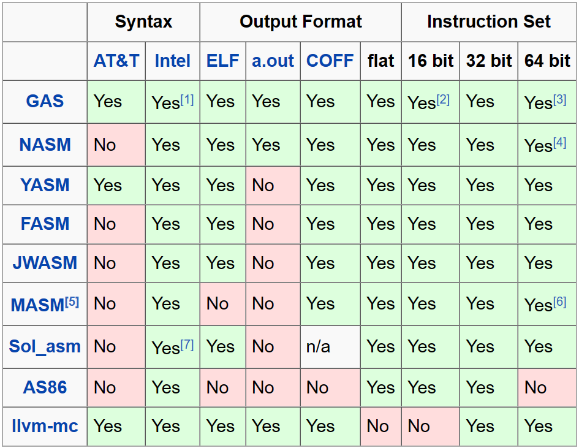

***

### 为什么要学汇编语言？

对于极少数人来说，可以用于编写操作系统、编写驱动、编写嵌入式代码。

对于大多数人来说，是为了理解计算机是怎么工作的，给学习其他语言打基础。

怎样判断自己是否应该学汇编语言：

***

### AT&T 语法和 Intel 语法

举一个简单的例子，把数字 1 加到寄存器 eax 中：

| 语法    | 示例           |
|-------|--------------|
| AT&T  | mov $1, %eax |
| Intel | mov eax, 1   |

AT&T 语法和 Intel 语法的区别：

|        | AT&T    | Intel |
|--------|---------|-------|
| 出现时间   | 更早      | 较晚    |
| 语法难易程度 | 更难      | 更简单   |
| 更常用的平台 | Windows | Linux |

新手推荐 Intel 语法，因为它更简单。

[其他区别参考维基百科](https://en.wikipedia.org/wiki/X86_assembly_language#Syntax)

***

### 不同的汇编器的区别。

汇编器是一种将汇编语言转换为机器语言的程序。

  
   
  <a href="https://wiki.osdev.org/Tool_Comparison" target="_blank">图片来源</a>

不同的汇编器侧重的架构有一些区别，各自支持的语法糖也有一些区别，但是大同小异，谈不上谁比谁更好。

教材里面用的是哪种汇编器，你就跟着用哪种汇编器，比如王爽的《汇编语言》这本书用的是 MASM，李忠的《x86汇编语言-从实模式到保护模式》这本书用的是 NASM。

***

### 汇编开发工具推荐

推荐工具：SASM

优点：

1. 开源
2. 免费
3. 支持四种汇编器：NASM、GAS、FASM、MASM
4. 可定制快捷键

缺点：

1. 如果不用它来编辑源代码，而用其他软件来编辑源代码，则SASM无法监控源文件的变化，需要手动刷新。

[下载地址：https://github.com/Dman95/SASM/releases](https://github.com/Dman95/SASM)
https://github.com/Dman95/SASM

***

### 第一行指令：mov ebp, esp

指令 `mov ebp, esp` 用于将基指针 (EBP) 寄存器设置为堆栈指针 (ESP) 寄存器的值。这是为了正确调试，因为它允许调试器更轻松地跟踪程序的执行。

堆栈指针寄存器包含堆栈顶部的地址。基指针寄存器用于访问函数中的局部变量和参数。当执行 `mov ebp, esp;` 指令时，堆栈指针的值被复制到基指针寄存器中。这确保了基指针寄存器始终指向当前函数堆栈帧的开头。

这对于调试非常重要，因为它允许调试器在程序执行过程中查看局部变量和参数的值随着时间的推移而发生的变化。如果没有 `mov ebp, esp;` 指令，调试器将无法正确跟踪这些变量和参数的值。# 待整理的资料

在汇编语言代码中，通常在每个函数的开头执行 `mov ebp, esp` 指令。即使不调试程序，也最好始终在代码中包含此指令。这将确保您的代码始终可调试，即使您将来需要调试它。

***

### 待整理的资料

[YouTube视频列表：Modern x64 Assembly](https://www.youtube.com/playlist?list=PLKK11Ligqitg9MOX3-0tFT1Rmh3uJp7kA)

[YouTube视频列表：x86_64 Linux Assembly](https://www.youtube.com/playlist?list=PLetF-YjXm-sCH6FrTz4AQhfH6INDQvQSn)
